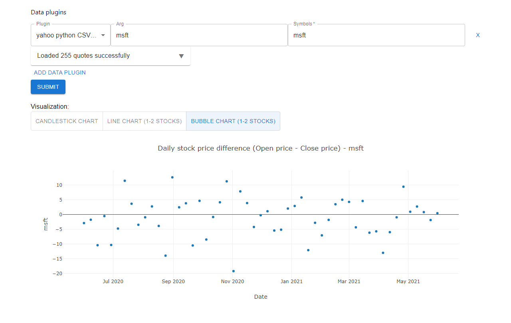

# MileStone C

Our team has two members, Lingzhi Ma and Zouyiyun Peng. we build on [team deadlinefighter's project](https://github.com/CMU-17-214/hw6-analytics-framework-deadline-fighters).

## Get Started

This project is using Spring Boot as backend and React as the frontend.

### Backend

Install the game and run the backend on localhost:8080.

```commandline
mvn clean install
mvn spring-boot:run
```

### Frontend

You need [Node.js](https://nodejs.org/en/download/) installed to run the frontend.
Change directory to the frontend and start the React on <http://localhost:3000/>.

```commandline
cd frontend
npm install
npm start
``` 

## Two data plugins:

-   YahooPyCSVDataPlugin
    (src\main\java\deadlinefighters\analyticsframework\plugin\data\YahooPyCSVDataPlugin.java)

-   MarketPyCSVPlugin
    (src\main\java\deadlinefighters\analyticsframework\plugin\data\MarketPyCSVPlugin.java)

## One visualization plugin:

-   BubbleChartVisualizationPlugin
    (src\main\java\deadlinefighters\analyticsframework\plugin\visualization\BubbleChartVisualizationPlugin.java)

&nbsp;

## Plugin detailes

### YahooPyCSVDataPlugin

The first data plugin uses yahoo python api https://algotrading101.com/learn/yahoo-finance-api-guide/.
After launching the project as the following says, we can choose yahoo python plugin in the Plugin drop-down box. 

The arg is the symbol of the stock. So we can enter the same thing for both arg and symbol fields (For symbol, it must be lower case).


### MarketPyCSVPlugin

The second data plugin uses marketstack api https://marketstack.com/documentation. After launching the project as the following says, we can choose market stock python CSV local file plugin in the Plugin drop-down box.

The arg field should be filled with an api key from the website and the symbol field is the stock's symbol.


### BubbleChartVisualizationPlugin

For the new visualization plugin, select bubble chart button in the Visualization part. Then a bubble chart suggesting the daily stock price differences will show, which presents the difference between open price and close price (ie: If the stock price increases, the difference will be greater than 0 and vice versa.)


&nbsp;

# Stock Price Analytic Framework

## Get Started

This project is using Spring Boot as backend and React as the frontend.

### Backend

Install the game and run the backend on localhost:8080.

```commandline
mvn clean install
mvn spring-boot:run
```

### Frontend

You need [Node.js](https://nodejs.org/en/download/) installed to run the frontend.
Change directory to the frontend and start the React on <http://localhost:3000/>.

```commandline
cd frontend
npm install
npm start
```

## Idea

The idea is to provide an analytics framework for users to analyze stock prices through data retrieval, processing and visualization.

By providing data plugins and visualization plugins interfaces, we allow users to retrieve stock quotes from different sources (provided by data plugins) and shows different results in different ways (provided by the visualization plugins).

In addition, the framework performs data processing that includes merging stock quotes from different data sources and aggregating them by different time period.

## How to extend

Both data plugins and visualization plugins can be extended.

To extend the data plugins, implement the `DataPlugin` interface and add the class name into `src/main/resources/META-INT/services/deadlinefighters.analyticsframework.framework.core.DataPlugin`.

To extend the data plugins, implement the `VisualizationPlugin` interface and add the class name into the according file under `src/main/resources/META-INT/services/deadlinefighters.analyticsframework.framework.core.VisualizationPlugin`.

Data plugins could provide _a list of stock prices with symbol, open price, close price, high price, low price, date_.

Data plugins:

-   **(Done)** Local file (e.g. csv)
-   **(Done)** Web APIs. Free time series stock API like [Alpha vantage](https://www.alphavantage.co/).
-   Database

Visualization plugins:

_[Plotly](https://plotly.com/) is used in this framework for visualization plugins._

-   **(Done)** Candlestick chart displaying the open, close, high, low price for a specific symbol during a time period.
-   **(Done)** Line chart displaying stock comparison between 2+ stocks.
-   Bubble chart displaying changes to different stocks within a specific time period.
-   Bar chart displaying changes to different stocks in a single day

## How to use the GUI

1. Select data plugins
    1. For CSV local file plugin, the path to csv file should be provided in the `arg` field, and the file follow the format in [src/main/resources/daily_IBM.csv](src/test/resources/all.csv) (note: volume column in the file is ignored in the plugin)
    2. For the Alpha vantage plugin, you should register for a free API key from the web page, and paste the key in the `Arg` field
    3. Add the symbols that you want to extract in the Symbols field, separated by comma if multiple symbols are needed
2. Press submit
3. Select the visualization plugin you want
    1. The candlestick chart supports only 1 stock, and uses daily data
    2. The line chart supports 1 or 2 stocks, and uses the aggregated weekly data

Example:

