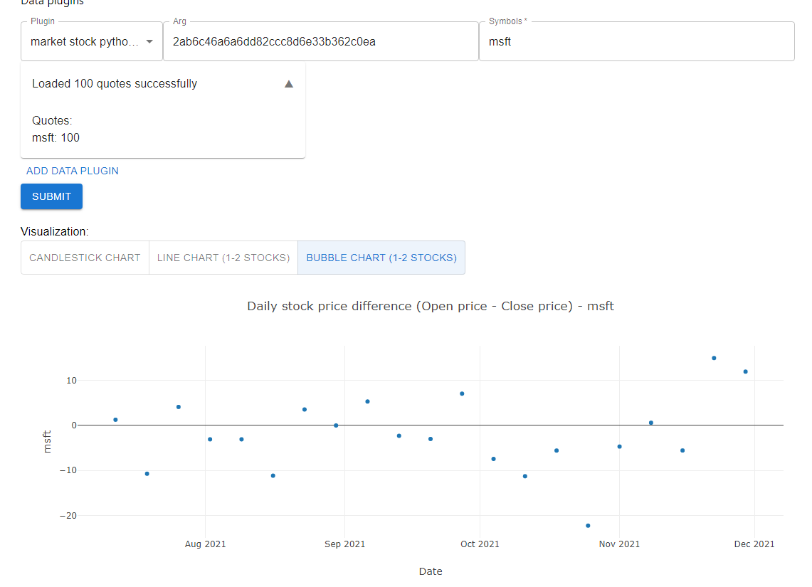

# hw6-analytics-framework-stomachache

# 📜 Pokenmon collection

## Start the project

To start the project, simply run the following command in the terminal:

```bash
npm install
npm run dev
```

Then the project will be running at http://localhost:3000/.

&nbsp;

## Extend the project

### Data Plugin

To add new feature to the project, a new data plugin should be implemented DataPluginInterface, which contains getData, parseData and prepareData methods.

- getData method: receives optional parameters and is used to query the external apis asynchronously.

- parseData method: receives the query data and conducts data cleaning and formatting.

- prepareData method: combines above two method, and returns a Promise object.

And after finishing implementing the DataPluginInterface and constructing the data plugin, do not forget to register it in the routes as an internal api.

For example, below is how do we register the getPokemonListPlugin:

```typescript
router.get("/api/getpokemonlist", (req, res, next) => {
  const pokemonList = new getPokemonListPlugin();
  pokemonList.prepareData().then((r) => {
    // call the prepareData method to query and parse data
    res.json(r); // send the parsed data to the result
  });
});
```

&nbsp;

### Visualization Plugin

Since we use React.js framework as frontend, we followed the functional component principle, where all the components are encapsulated in functions, not in classes. To add a new visualization plugin, you will need implement a functional component. And then add the new component in the App.tsx.

&nbsp;

## API Documentation

### barchart

After call this api, it can initialize a BarChartDataPlugin class. Its prepareData function will be called to prepare data and send the data to visualization plugin. After the front end receives the data, it will generate the following chart. It shows the number of pokemons in each type.  

### topfireweight

After call this api, it can initialize a TopBarChartDataPlugin class. Its prepareData function will be called to prepare data and send the data to visualization plugin. It shows the top 10 heaviest file type pokemon.


### getpokemonlist

This api uses the getPokemonListPlugin plugin, where we query list of Pokemons data from the PokemonClient. No input is needed. The output is a NamedAPIResourceList object, which contains series of pokemon data.


&nbsp;
