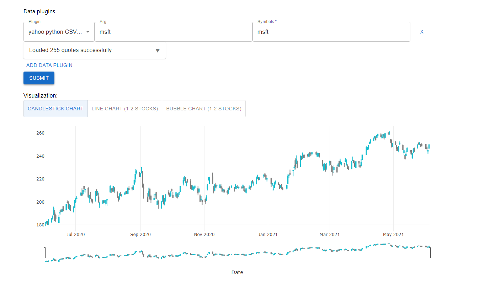
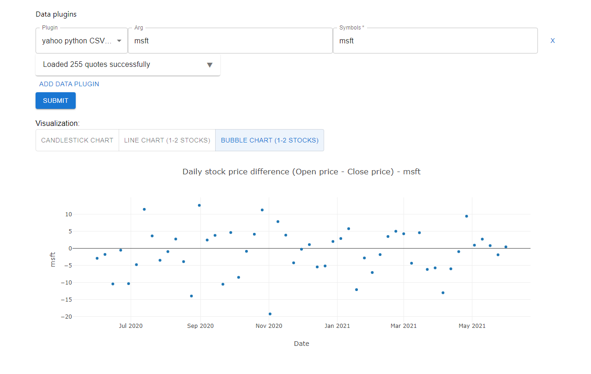

# Domain


Pokemon Analysis Framework


We will implement a Pokemon query and visualization platform, where Pokemons’ characters including moves, abilities, heights and weights will be present. There are more information we can visualize. It can show the number of pokemons in each type, such as flying, fire, water, and so on. Besides, it can show the top 10 pokemons with high attack or high defense.

For data source, we will use PokeAPI ( https://pokeapi.co/), which is a full RESTful API linked to an extensive database detailing everything about the Pokémon main game series, and requires no authentication. It returns Json through URLs. For example, to query Ditto’s (a Pokemon) data, we can simply enter https://pokeapi.co/api/v2/pokemon/ditto, which returns a JSON object including all Ditto related data.

Also there are many wrapper libraries using this API. Since we use TypeScript, we will import a Node Server-side with an auto caching library called Pokedex Promisev2 https://github.com/PokeAPI/pokedex-promise-v2.

- Data plugins:
  - The basic data for each single Pokemon, including height, weight and movement.
  - Collection data for every type,  including average attack and defense data. 
- Visualization plugins: 
  - Tables represents the basic data for single Pokemon.
  - Bar chart shows the comparison data for different types of Pokemon.

# Generality vs specificity
- Key Abstractions

  The key abstractions of our project are data plugin and visualization plugin interfaces, where we used to define the common uses and signatures of the plugins. For example, we have completed design for the data plugin interface. It has getData, parseData, and showChart methods. For each data plugin concrete class, all its methods are specific. 

- Reusable Functionality

  To make functions and components reusable, we will abstract common functions, like get data and send data, into the superclass, which will be inherited by specific plugin classes. And the subclasses can reuse the common functions easily, which avoid repeated implementation of similar functionality.

- Potential Flexibility

  We use plugins and abstract them into interfaces for extensibility and flexibility. If more features are added in the future, for example, adding new graphs and new data categories, it can be achieved simply by adding new plugins, and no need to change current code.

  To be more specified, framework can know which data plugin to use and it calls this data plugin to show the chart. It will register every data plugin, asks the data, and uses React to show the chart. In this way, if we want to add more data plugs, we just need to implement more data plugin classes, and add more components in the web page, where we maximize the extensibility of the project.


# Project structure

To utilize express library, we divide the code to two parts, one is client and the other is server. The server part takes charge of using apis to get data. The client part will decide which chart will be shown and call the server to fetch corresponding data.

The data plugins are located in the server folder such as barchart.ts. The visualization plugins are located in the client folder such as SimpleChart.tsx. The framework will also be located in client folder.

&nbsp;


In the server folder, the server.ts controlls which port to listen to. The routes.ts registers all the routes. Each route calls its corresponding data plugin to fetch data. In the following code snippet, it calls async function getData() to get data. After this, it sends data to the corresponding visualized plugin in the client folder.

```typescript
router.get("/api/barchart", (req, res, next) => {
  getData().then(r => {
    const result = {xdata: r.xdata, ydata: r.ydata }
    res.json(result)
  })
});
```

The fetched data object has two arrays to store x-axis data and y-axis data.

```typescript
const x: string[] = []
    const y: number[] = []
    await Promise.all(types.results.map(async (type) => {
      if (isNamedAPIResource(type)) {
        const result = await api.getTypeByName(type.name)
        x.push(type.name)
        y.push(result.pokemon.length)
      }
    }))
    return {xdata: x, ydata: y }
```

The following is an example from SimpleChart.ts in client folder. The res variable fetchs data from the server and pass the data to React Api to fill the chart.

```typescript
try {
    const res = await fetch('/api/barchart')
    const mapdata = await res.json()
    console.log("xxxxxx")
    console.log(mapdata)
    setXdata(mapdata.xdata)
    setYdata(mapdata.ydata)
    } catch (error) {
    console.log(error);
    }
```


# Plugin interfaces

### Data plugin
Data plugins may include plugins to fetch different kinds of bar chart data.
getData is to use website api to fetch the original data sets.
parseData is to extract, aggregate and trim the original data to get the data that we want to visualize.
prepareData is the function we will call to export for other component to call. It will combine getData and parseData.

```typescript
export interface DataPluginInterface {
    getData: (p?) => any;
    parseData: (p: any) => any;
    prepareData: (p?) => any;
    // onRegister: () => void;
}
```
### Visualization plugin
Visualization plugins will use x,y-axis data to draw the graph. Here is an example shows the number of pokemons from different types.
```typescript
interface VisualizationPlugin {
    setData: (route: string) => any
}
```




# Reference:

https://pokeapi.co/api/v2/pokemon/charizard
https://covid19api.com/
https://polygon.io/docs/get_v1_marketstatus_upcoming_anchor
